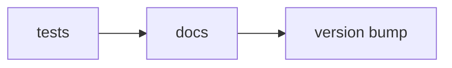
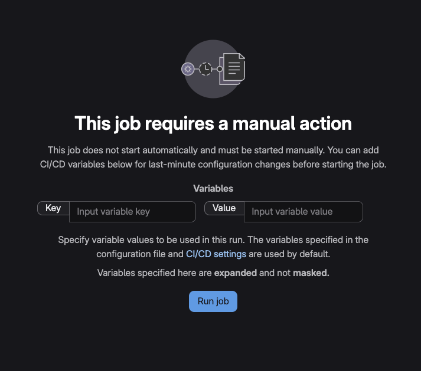

# Time Trace Tools 
***Note: This project is maintained by the lab of David Dulin at VU Amsterdam, and the corresponding code is on their private GitLab account. This repository merely serves as a snapshot to show publicly.***

A handy-dandy toolkit for analyzing time trace data from either the magnetic tweezers or the TIRF microscope. 
This package is intended to contain tools that make developing subsequent analysis code easier. 

### Why this toolkit? 
Working with experimental data can be cumbersome, needing to remember in detail how the data is stored (which columns / rows are the time axis/position axis etc.), or details of how to perform common operations (background correction / reference bead subtraction etc.). 
This all requires rewriting quite a bit of code every time you need to load a single dataset into your script. There's got to be a simpler way! 

Also, performing more (advanced) analysis (filtering, first passage time analysis etc.) is not always the most accessible to the non-modeling experts in the lab. 

### How does TimeTraceTools solve things? 
**1. First, it offers a 'Numpy-like' way of manipulating your time traces, by defining a generic `TimeTrace` class.** 
* Simply add or subtract traces. 
* Simply add, subtract, multiply, or divide a trace by a constant value. 
* A trace is *anything with a time axis and any set of additional named value arrays*. Currently, specific implementation for magnetic-tweezers traces is included. Simple to extend to fluorescence experiments. 
* Qualitative labels can be assigned to either the entire trace, or to sections of a trace (a particular time window). 

**2. To manipulate a complete dataset, we define a `Experiment` class.**
* Simple (unified) syntax for loading data from different experimental instruments (legacy format data? No problem, let Time Trace Tools take care of loading things into the same format.)
* Need to merge traces from multiple datasets? Simply add the Experiments together. 
* Need to include / exclude a particular trace from your experiment? Simply add it to, or subtract it from, your Experiment. 
* Experiments are generic. Current implementation for data from magnetic tweezers is provided. Simply to extend to data from fluoresence traces or even particular types of magnetic-tweezers experiments. 

**3. Analysis is made more accessible, and flexible.**
* Use an `ExperimentProcessor` handle applying a series of `Transformations` on your `Experiment`. 
* `Transformation` for most common operations (filtering, shifting / scaling traces etc. included). 
* Create a list of `Transformations`, register at `ExperimentProcessor`, and go! 
* Simple undo / redo behavior out-of-the-box. (Uses the 'command design pattern' to achieve this. Internally the manipulated traces are not stored after any intermediate steps, meaning you also never have to define any 'inverse operation' to undo an action.) 

##  Documentation

You can view the full project documentation here:

👉 [View the Documentation Website](https://time-trace-tools-3ff349.gitlab.io/)
**This site also contains notes on the software design & guidelines for contributing/developing**

👉 [View detailed test coverage report](https://dulinlabvu.gitlab.io/time-trace-tools/coverage/index.html)
(***coverage reports will persist for 1 week after the commit***)

# &#x1F501; GitLab actions 
When you push to the `main` branch the following will happen automatically: 

**🧪 tests (&#x2705; success required)**
* unit tests: Assert crucial functionality is not hampered with. 
* Only continue when you pass 

**&#x1F310; docs (&#x2705; success required)** 
* builds the MkDocs webpage 
* deploys it on GitLab pages 
* only continue upon success 

**&#x1F3F7; version bump (&#x1F464; manual trigger)**
* On GitLab/GitHub manually enter the bump (major, minor, or patch)
* Bumps the package version in `pyproject.toml` (mainly for documentation purposes)
* Creates a git tag with the new version and pushes this to the remote. 

**NOTE: To initiate the version bump, click on the job in the pipeline. You will see the following screen. Enter `VERSION_TYPE` as the key and any of 'major', 'minor', or 'patch' as the value. This specifies how you want to bump the version.**

**NOTE 2: After doing this, you probably want to `git pull origin main` in order to have the updated `pyproject.toml` with the bumped version on your local repository.** 

 

