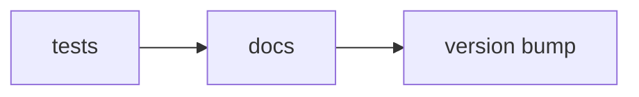

# Time Trace Tools 
A handy-dandy toolkit for analyzing time trace data from either the magnetic tweezers or the TIRF microscope. 
This package is intended to contain tools that make developing subsequent analysis code easier. 

##  Documentation

You can view the full project documentation here:

👉 [View the Documentation Website](https://time-trace-tools-3ff349.gitlab.io/)
**This site also contains notes on the software design & guidelines for contributing/developing**

👉 [View detailed test coverage report](https://dulinlabvu.gitlab.io/time-trace-tools/coverage/index.html)
(***coverage reports will persist for 1 week after the commit***)

# &#x1F501; GitLab actions 
When you push to the `main` branch the following will happen automatically: 

**🧪 tests (&#x2705; success required)**
* unit tests: Assert crucial functionality is not hampered with. 
* Only continue when you pass 

**&#x1F310; docs (&#x2705; success required)** 
* builds the MkDocs webpage 
* deploys it on GitLab pages 
* only continue upon success 

**&#x1F3F7; version bump (&#x1F464; manual trigger)**
* On GitLab/GitHub manually enter the bump (major, minor, or patch)
* Bumps the package version in `pyproject.toml` (mainly for documentation purposes)
* Creates a git tag with the new version and pushes this to the remote. 

**NOTE: To initiate the version bump, click on the job in the pipeline. You will see the following screen. Enter `VERSION_TYPE` as the key and any of 'major', 'minor', or 'patch' as the value. This specifies how you want to bump the version.**

**NOTE 2: After doing this, you probably want to `git pull origin main` in order to have the updated `pyproject.toml` with the bumped version on your local repository.** 

 

