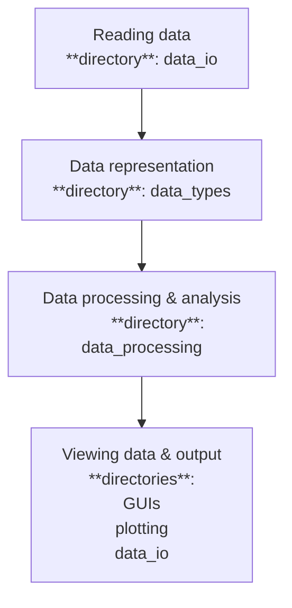

# Pytweezer Tools
Tools for analyzing data from magnetic tweezers, TIRF microscope, or any combination. 

## Quick start guide
The following demonstrates a birds-eye view how to handle data from a magnetic tweezers experiment in `pytweezer-tools`. For the purpose of making this guide consise, it is assumed the data was acquired using `pytweezers`. Rest assure that dealing with data from fluorescence microscopy or older data acquired using LabView is not much more difficult. 

### loading data 
The `data_io` directory contains all funtions needed to read/write data. 
To load data obtained using `pytweezers`
```python
from data_io.raw_mt import read_raw_mt

FILEPATH = "path_to_file"

# NOTE: This function also happens to work with data from LabView. 
bead_positions_xyz, time = read_raw_mt(path = FILEPATH)
```
This returns a `bead_position_xyz` array of size `(num_beads, num_frames, 3)` and a `time` array of size `num_frames`. 

### time traces
<span style = "color:lightblue">**NOTE: some of the code blocks contain spuedocode to make the explanation simplier.**</span>

For convinience, `pytweezer-tools` contains objects of the type `TimeTrace`: simple contianers with a time array and any number of named value arrays (of the same length). It also has an identifier, optional labels and labeled sections. 
For example, data from magnetic tweezers measurements can be represented as `MagneticTweezerTrace` instances
```python
# The following is not the actual implementation. Many things are actually inherited from the `TimeTrace` class and are also available for traces containing fluorescence data 
class MagneticTweezerTrace(TimeTrace):
    ID: str     
    t: NumpyArray
    x: NumpyArray
    y: NumpyArray
    z: NumpyArray 

    # NOTE: time traces also have (optional) labels and labelled sections. 
    # Ommited here to keep this consise. Feel free to take a look at the actual code (no touchy though ;-) ) 

```
After loading your data, you can create a `MagneticTweezersTrace` as follows
```python
import numpy as np 
from data_types.magnetic_tweezer_trace import MagneticTweezerTrace
# here, just demonstrated for the first bead. See below how to deal with the entire set of traces in a more convenient way 
x = bead_positions_xyz[0, :, 0]
y = bead_positions_xyz[0, :, 1]
z = bead_positions_xyz[0, :, 2]

# create the trace 
trace = MagneticTweezerTrace(time, x,y,z, ID="bead_1")
# You now can find the z-position of the first bead by calling
print(trace.z)
```
We can now add labels to the entire trace, or to specific sections of the trace as follows
```python
trace.add_label("pretty trace")

# Say, you want to analyze just the start of the trace for some reason
start_section = 0 
end_section = 100
trace.add_section(start_frame_number=start_section, end_frame_number=end_section, label="before adding reagents")

# This will store the section in a dictionary with a key of (start_frame_number, end_frame_number) and value "before adding reagents" (i.e. the chosen label).

# Process just a part of the trace

def your_very_important_function(z: NumpyArray, t: NumpyArray) -> NumpyArray:
    '''calculate something based on the heigth of a bead and return a new array'''

for (section,label) in trace.sections.items():
    if label == "before adding reagents":
        ''' 
        retreive the important part of the trace and apply your very important function to it
        '''
```

Time traces also have some convenience methods available for adding/removing labes, altering labels, adding/removing sections, accessing the section, quickly viewing all sections of a particular label, etc. Also, general arithmatic for shifting, adding, and averaging traces are available. 
<span style="color:lightblue"> **NOTE:** see the `README.md` in the `data_types` directory for all the available functions.  </span>

An `Experiment` deals with a data set with multiple traces. For a typical magnetic tweezers experiment, create a `MagneticTweezersExperiment` 
```python 
#NOTE: Similar to the `MagneticTweezersTrace` demonstrated above, many things demonstrated here for a   `MagneticTweezersExperiment` can be used with any implementation of an `Experiment`

from data_types.magnetic_tweezers_experiment import MagneticTweezersExperiment
from data_io.raw_mt import read_raw_mt
# create an experiment with some descriptions. 
# At minimum, it should have an identifier. 
# Other information can be provided later. 
mt_experiment = MagneticTweezersExperiment(
    ID="simple identifier. For instance '500 µM NTP'",
    
    # A dictionary with any information you want to use to specify the experimental conditions. This is optional, not need to instanciate an Experiment. 
    experimental_conditions={
        "protein_X_uM" : 1.,
        "protein_Y_uM" : 2.,
        "NTP_uM": 500.,
        "force_pN": 25.,
        ...
    }
    ref_bead_nr = 1 # say, the first bead is the reference bead
)

# load the raw data. 
FILEPATH = "path to raw data"
mt_experiment.load_raw_data(path=FILEPATH, use_method=read_raw_mt) # will store the raw data as class attribute

# create the series of `MagneticTweezerTrace` instances 
mt_experiment.create_traces_from_raw_data()

# traces are stored in a list with objects of type MagneticTweezerTrace 
mt_experiment.traces : list[MagneticTweezerTrace]


# perform reference substraction 
mt_experiment.substrace_reference_bead() #NOTE: you can use this function to change reference bead 

# access the 50th trace for further inspection (just an example)
trace_50 = mt_experiment.fetch_trace(ID="trace_50") 

```
Now you can access functions to assign a label to a (set of) trace(s), or to a part of a trace, simple access to all traces with a particular label, or access a particular part of all traces. 
For some of the specific implementations (for particular assays) there might be even functions that can set the experiment name from the filename for instance. 

<span style="color:lightblue">NOTE: See the `README.md` inside `data_types` for all available methods and their functions. There are much more than demonstrated in this bare bones example</span>

Typically the `MagneticTweezerExperiment` class will be your entry point for dealing with experimental data. 
To conveniently deal with a series of `Experiments`, create an `ExperimentSeries`. 
For typical magnetic tweezer experiments 

```python 
from data_types.magnetic_tweezers_experiment_series import MagneticTweezerExperimentSeries
from data_types.magnetic_tweezers_experiment import MagneticTweezerExperiment


# example 1: repeat experiments. Starting from the individual experiments

experiment_1 = MagneticTweezersExperiment(ID='first experiment')
experiment_2 = MagneticTweezersExperiment(ID='second experiment')

repeat_experiments = MagneticTweezerExperimentSeries(experiments=[experiment_1, experiment_2])

# oops, forgot to add one more repeat 
experiment_3 = MagneticTweezersExperiment(ID='third experiment')
repeat_experiments.add_experiment(experiment_3)

# example 2: Use the filenames to the raw data sets 
FILEPATHS = ["path/to/file 1", "path/to/file 2"]
EXPERIMENTS = ["first", "second", "third"]
repeat_experiments = MagneticTweezersExperimentSeries()
repeat_experiments.create_experiments_from_raw_data(paths = FILEPATHS, ID_list = EXPERIMENTS)

# Now you can manually create the traces for the individual experiments as shown above. NOTE: For convenience this is done internally, so in most cases don't need to call yourself. 
repeat_experiments.create_traces()


# example 3: Sweep NTP concentration 

COMMON_CONDITIONS = {"force":25.,  "protein_concentration": 0.2} 

CONCENTRATION_SWEEP = {'[NTP]':[0., 10., 100., 1000.]}
FILEPATHS: list[str] = []

concentration_sweep = MagneticTweezersExperimentSeries(paths=FILEPATHS)
# automatically take care of creating instances of `MagneticTweezerExperiment`, with their respective IDs based on the NTP concentration. 
concentration_sweep.create_experiments_from_sweep(dependent_variable=CONCENTRATION_SWEEP, common_conditions=COMMON_CONDITIONS)
```
<span style="color:lightblue">NOTE: See the `README.md` inside `data_types` for all available methods and their functions. There are much more than demonstrated in this bare bones example</span>


### Process time traces 
Having created your `TimeTrace`, `Experiment`, or `ExperimentSeries` data processing is handled by a `DataProcessor` that can apply methods to traces 
<span style="color:yellow">NOTE: THINK THIS PART THROUGH MORE. MAINLY WANT FAST WAYS OF INSTANTIATING PIPELINES FOR FREQUENTLY PERFORMED EXPERIMENTAL ASSAYS</span>

```python
from typing import Callable 
class DataProcessor:
    methods: list[Callable]
    traces: list[TimeTrace]

    def register_method(function: Callable) --> None:
    def unregister_method(function: Callable) --> None:

    def apply() --> None: 
        '''
        Applies the set of register methods to all the supplied traces
        '''

```

### Output the data 
We again turn to the `data_io` package
<span style="color:yellow">NOTE: Add later</span>

Convenience methods for plotting subsets of traces 
```python
from plotting import plot_mt_trace,

???
```

View data within a GUI. For example, see.... 
```
```
<span style="color:lightblue">NOTE: See below for tips to make your own GUI. The `gui` library has a set of plug-and-play components you can use to speed up the process of making a gui for yourself. </span>


## More detailed guide
At its core, `pytweezer-tools` contains the following building blocks: 

<span style = "color:lightblue">**NOTE  1:**</span> Individual sub-libraries have their own `README.md` file. 


<span style = "color:lightblue">**NOTE  2:**</span> this follows the natural workflow for analysing data from `pytweezers`. These core elements are intended to keep decoupled from each other. That is:
* If you want to add a new kind of data type (say a three color fluorescence trace). You should only have to define this new type. Functions acting on time traces are not allowed to depend on the specifics of a fluorescence trace (say, the number of colors it has). In stead, we supply the `TimeTrace` or `Experiment` as inpout to the `DataProcessor`.  
* If you want to add a new kind of output file, you should only have to add a reading and writing function in `data_io`. The data structures `TimeTrace`, `Experiment`, etc. are not allowed to know the specific implementation used to write the data. In stead, we supply the trace as an argument to the writing function (_or vice versa if appropriate_). 

This principle is called **_'dependency injection'_** and essentially prevents us from writing code that has extensive checks for "if the data is from the magnetic tweezers, do A. if the code is from the TIRF, do B." Adding a new type of data is then as easy as defining this new class. No need to expand all these `if else` cases in the data processing functions, the reading/writing, etc. 


### Data reading (and writing)
Functions to read raw data from magnetic tweezers, TIRF microscope, etc. 
```python
from data_io.raw_mt import read_raw_mt

FILEPATH = "path_to_file"

bead_positions_xyz, time = read_raw_mt(path = FILEPATH)
```
Legacy support for data acquired using `LabVIEW` is also available. 
See readme for more details. 


### Data types
<span style = "color:lightblue">**NOTE: some of the code blocks contain spuedocode to make the explanation simplier.**</span>

Most of the data we encounter are forms of time traces. A generic time trace has a time array and any number of additional value arrays. 

```python
class TimeTrace:
    time : NumPyArray
    **values : dict[str, NumPyArray]

    def _validate_time_trace():
        ''' a time trace must have an equal number of datapoints and time points '''

    def __len()__:
        return len(self.time)
```
Here we defined a generic `TimeTrace` class to represent anything that has some array named `time` and any additional named arrays of similar length.


###  notes on project design and structure (<span style="color:red"> move some of this into the notes of writing clean code</span>)
The following were kept in mind as key requirements in choosing the structure for this package.

1. **Increased flexibility**: 

    Dealing with data from different kinds of setups (magnetic tweezers and/or different kinds of fluorescence datasets). Allowing for custom analysis pipelines.

2. **Varying coding experience levels amongst users**:

    Make the code as readible as possible: **type hints**, **clear naming**, **docstrings and documentation** (where nessecary).
    Further explanation is provided below. 
    Automated code formating using the `ruff` tool (VScode extension added as recommended)

    Lower barrier for adding new code: Minimize coupling between different parts of the code (if not possible to completely eleminate)
    subdirectories are intentionally made to be python libraries (i.e. containing an `__init__.py` file)
    This is done as an additional insentive to make code as portable as possible. For example, a set of functions used to filter signals should be able to be used as a stand alone library in some unrelated project. 
    Also, users wanting to make code just pertaining to their experiments can add their own folder/library in this way. 
    This way the 'less optimally written code' will hopefully be contained within this folder. 


3. **Make the code as modular as possible** 

    Separate **reading data**,**data representation within the code**, **analysis performed on the data**, **output of the data to a file and/or GUI**. 
    If a class that stores bead position information also has a method to write the data to the file, the following happens:
    - If you decide to alter the way data is represented, you need to alter the function for writing the data 
    - If you decide to change the output file format, you need to change both the function used to write the data, as well as the class storing the data (as you hardcoded that the function depends on a particular implementation of the function)

    In stead, the concept of 'dependency injection' is used. 
    A `DataProcessor` object gets a `TimeTrace` object as its input and does not use any information regarding implementation details of the `TimeTrace` object. 
    Now, with hardly any more work the code can now work with any kind of time trace. Also, adding more types of time traces can be done without altering any of the functions used to process the data. 


(NOTE: name is chosen as a reference to the `pytweezers` project, even though it does not explicitly depend on it)
## Quick overview 
<span style="color:red"> add details into some more detailed manual?</span>.

Code snippets show simplified code /speudocode. 
### data representations 
Most types of data we use are a kind of `TimeTrace`, which is defined as anything that has both a time array and any number of value arrays. 

```python
class TimeTrace:
    time: NumpyArray 
    **values: dict[str, NumpyArray]

    def _validate_timetrace():
        ''' checks if all the lengths are correct ''' 

    def __len()__:
        ''' if you call the len() method, you want it to return the number of time points. This should be equal to the number of elements in the value arrays. ''' 

    
    def get_values():
        ''' return the values ''' 

```

The code recognizes `TimeTraces` as a type. Examples of members are 
a trace from the magnetic tweezers 

```python
class MagneticTweezersTrace(TimeTrace):
    x : NumpyArray
    y : NumpyArray 
    z : NumpyArray 
```
or a trace from the TIRF microscope
```python
class OneColorFluorescenceTrace(TimeTrace):
    intensity: NumpyArray 

class RedGreenFluorescenceTrace(TimeTrace):
    red: NumpyArray
    green: NumpyArray 
```

Some examples made for convinience: 
```python
class FRET(TimeTrace):
    donor: NumpyArray
    acceptor: NumpyArray 

    def calculate_fret_efficiency() -> NumpyArray:
        ''' calculates acceptor/(donor + acceptor) '''


class MT_TIRF_Trace():
    mt_trace : MagneticTweezerTrace 
    tirf_trace: FluorescenceTrace 
```


## Installation Guide 

## Contributing

## License
For open source projects, say how it is licensed.


