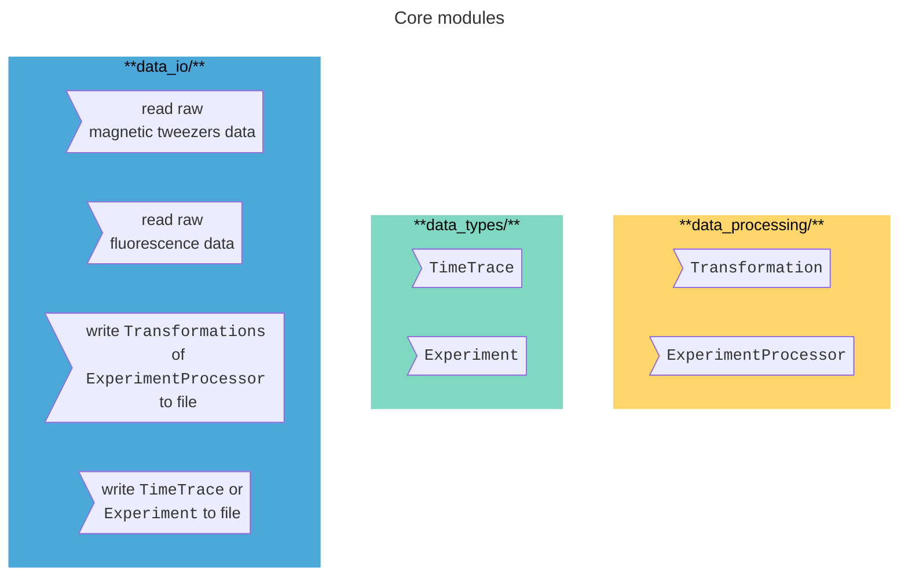
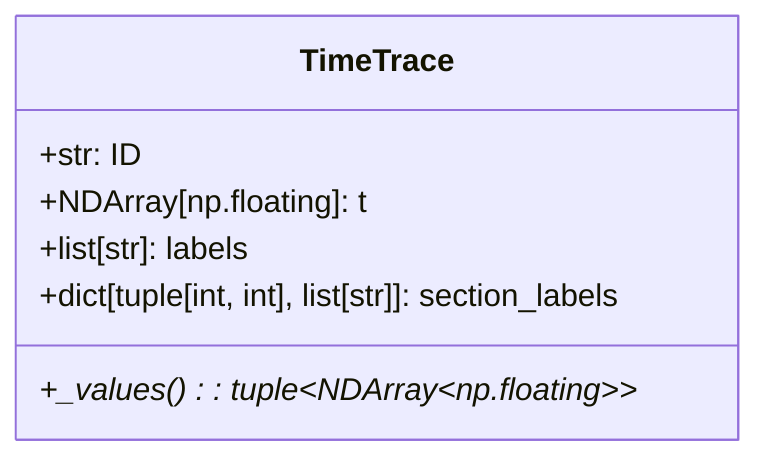
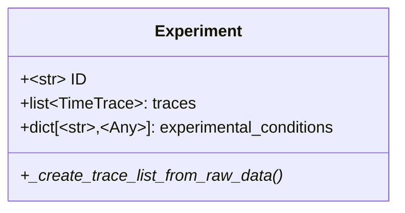
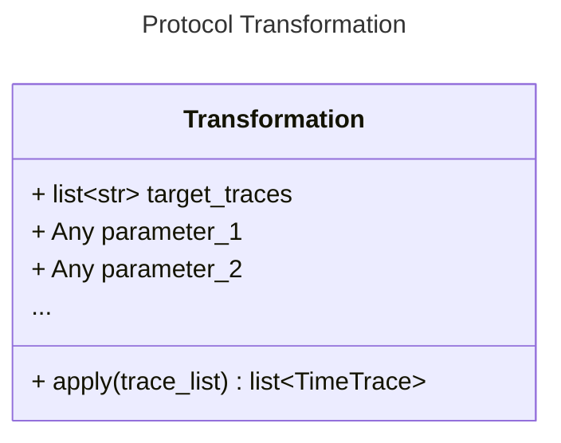
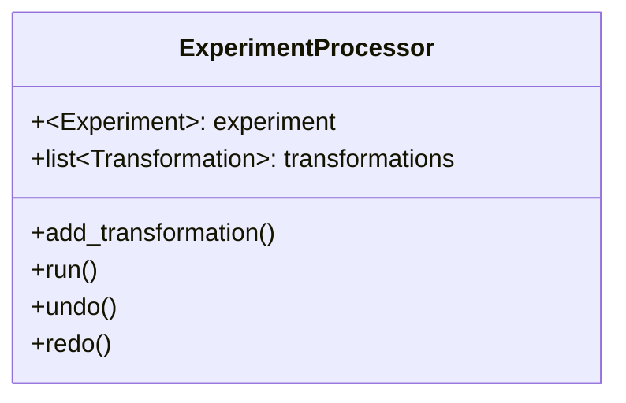
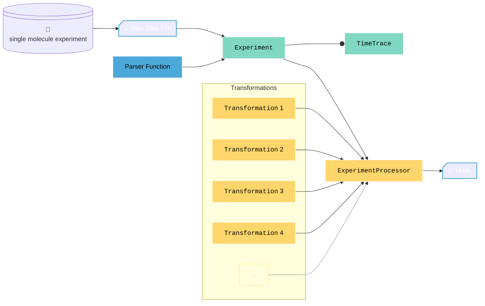

# Data processing tools

**working title: pytweezers-tools**- 
<span style="color:#FFE99A"> <u>**Suggestions for a good name are welcome (no need to contain 'py')**</u> </span>

**description:** *library for handling and (post-)processing data from high-throughput single-molecule experiments (e.g. magnetic tweezers, TIRF/fluorescence microscopy data).*

- [Data processing tools](#data-processing-tools)
- [Quick start guide](#quick-start-guide)
  - [Loading raw data into your code](#loading-raw-data-into-your-code)
  - [Postprocess your experimental data](#postprocess-your-experimental-data)
  - [What does saved data look like ?](#what-does-saved-data-look-like-)
- [Software Design notes](#software-design-notes)
  - [Desired (user) experience stories](#desired-user-experience-stories)
  - [Core concepts](#core-concepts)
    - [`data_io`](#data_io)
    - [`data_types`](#data_types)
    - [`data_processing`](#data_processing)
  - [Show high-level class diagrams / workflow diagrams](#show-high-level-class-diagrams--workflow-diagrams)
  - [repository structure](#repository-structure)
- [Installation](#installation)
  - [Users (non-developers).](#users-non-developers)
  - [Developers](#developers)
    - [using `uv`](#using-uv)
    - [using `conda`](#using-conda)
  - [VS-code setup](#vs-code-setup)
- [Versioning](#versioning)
- [Contribute](#contribute)


# Quick start guide
If you do not need to understand the *why* and the *how* of this library, here are some example code snippets that explain the most important use cases. 

## Loading raw data into your code 
Having acquired your raw data file using our magnetic-tweezers, or MT-TIRF setups, the following will create an `Experiment` object that holds your time trace data. 
The `Experiment` object not only stores a list of `TimeTrace` objects, representing the individual time trajectories of the beads / fluorescent spots, it also allows for some more convenient manipulation. See below for more details. 

```python 
from data_io.read_mt import read_mt 
from data_types.magnetic_tweezers_experiment import MagneticTweezersExperiment

# show how to instantiate the `Experiment` + load the data using the specified data reading function 
```
## Postprocess your experimental data 
The `ExperimentProcessor` handles applying a series of `Transformations` and subsequent `Analysis` on your `Experiment`

```python 
from data_processing.processor import ExperimentProcessor 
from data_processing.filters import KeizerBesselFilter 

# Show how to instantiate the ExperimentProcessor and apply some Transformations 
```

Undo the last `Transformation` 
```python
# Simply tell the processor to apply everything excluding the last Transformation 
processor.undo()

# perform pipeline again 
processor.run()
```

Changed your mind? Redo the last `Transformation`
```py
#similar to the above: Tell the processor include the final Transformation once again  
processor.redo()

# re-run the pipeline 
processor.run() 
```

## What does saved data look like ? 
Instead of storing all intermediate transformed version of traces (as we did in the past), we simply store the raw data and a set of instructions from which you can recreate the processed data. 

```python 
from data_io.ENTER_NAME import FUNCTION NAME

f(filename = "", processor=processor)
```

The output will be a `TOML` file containing the following 

```TOML
[experiment]
raw_data_file = path/to/raw/data/file 
load_traces_using = function_name 
type = 'MagneticTweezersExperiment[MagneticTweezersTrace]'
number_of_traces = 200 
reference_beads = ['trace_1','trace_2','trace_3']

[transformations]
[[transformations.SelectTracesByLabel]]
target_traces =  ['trace_1', 'trace_2', ..., 'trace_200']
target_labels =  ['activity']

[[transformations.KeizerBesselFilter]]
target_traces = ['trace_5', 'trace_77','trace_78','trace_80',...,'trace_191']
frequency_Hz = 1000. 
```

<span style = "color:#FFE99A">**individual `README.md` inside the three core packages show more details of available classes/ functions/features**</span>


# Software Design notes 
Here, we detail some software architectural choices / the goal of this software package in broad strokes. 

## Desired (user) experience stories
The following formulates the set of <span style = "color:#ADEED9">requirements</span> this software library must have to achieve the following <span style="color:#FFE99A">goals</span>.


><span style = "color:#FFE99A">Generally speaking, this software should provide the user with ...</span>
- A <span style = "color:#ADEED9">toolkit</span> with functions, classes, and objects that can be imported into any other dedicated data analysis pipeline. Creation of <span style = "color:#ADEED9">*a GUI is is not a concern of this project*</span> as that should be a series of interactive components that call the elements available in this library.  
- A <span style = "color:#ADEED9">convenient syntax </span> to apply most <span style = "color:#ADEED9">data processing pipelines</span> to most <span style = "color:#ADEED9">data sets</span> with the same <span style = "color:#ADEED9">relative ease</span>. 
><span style = "color:#FFE99A">A user can easily load and manipulate data from all of our experimental setups (MT, MT-TIRF, old interface / new interface, etc.) in a unified manner </span>

- modules for parsing <span style = "color:#ADEED9">data acquired with different setups, controlling software / frameworks</span>. The data should be parsed into a unified format for postprocessing. 
- Create a generalized internal representation of experimental data for us to <span style = "color:#ADEED9"> manipulate time traces from either magnetic tweezers or fluorescence experiments similarly</span>. 
- Simplify the <span style = "color:#ADEED9">default output files</span>, making it easier to interpret and reuse data in the lab. 


><span style = "color:#FFE99A">The user should have the flexibility to apply any desired postprocessing pipeline to its respective data. Applying any kind of pipeline should happen at the same relative ease. </span>

- <span style = "color:#ADEED9">Same syntax, regardless of assay</span>. Treat force spectroscopy, torque spectroscopy, as well as fluorescent, and FRET time traces with the same operations. In an abstract sense, these <span style = "color:#ADEED9">all deal with time traces</span>. 
- Flexibility to <span style = "color:#ADEED9">change the order of operations</span> in postprocessing and analyzing data. For example, while assays may require you to filter the traces as the first step in the process, others may require to perform some other manipulations beforehand. 


><span style = "color:#FFE99A">The code in this repository should be as easy to read as possible. Prioritize readability over feature depth / complexity. </span>

- Reduce coupling: loading data and processing data are <span style = "color:#ADEED9">different concerns</span> and should be done using <span style = "color:#ADEED9">dedicated modules (packages)</span>. 
- <span style = "color:#ADEED9">Well-written code can be 'self-documenting'</span> for the most part. Adding type hints to a carefully chosen name for a function and its input / output variables leaves little doubt on what it does and how it should be used. 
- Try to adopt some standard best practices for <span style = "color:#ADEED9">versioning</span>, <span style = "color:#ADEED9">testing</span>, and <span style = "color:#ADEED9">maintaining</span> a python package. 


- See <span style = "color:#ADEED9"> `DEVELOPER_GUIDELINES.md` </span> for more details on some 'house rules'. 


## Core concepts 
This library contains the following core elements


The code is organized based on the natural flow of data. 

### `data_io`
Contains modules for reading raw experimental data and for writing the results of analysis performed on the data. These modules are likely the most specific to the type of experimental setup used in the lab (especially the reading of data). It is also likely the part to be subject to the most change over time (especially the format results are stored as). Splitting off these functionalities into their own package therefore enforces one to make the other components of this library to be reusable / adjustable to any type of input/output format. 


<span style="color:#FFE99A">For more info see `data_io/README.md`. </span>

### `data_types`
After parsing your raw data file, you need an internal representation of the data that makes it convenient to manipulate. 
This package introduces two core classes: `TimeTrace` and `Experiment`. 




These two core classes are defined as Abstract Base Classes (`ABC`). Meaning although we are unable to define all kinds of `TimeTraces` or `Experiments`, we know for certain that:
* A `TimeTrace` as a time array. 
* A `TimeTrace` has any number of additional value-arrays. For a `MagneticTweezersTrace` this will be the x,y, and z coordinates of the bead. A `FluorescenceTrace` will have intensity values in stead. Value arrays must be of the same length as the time array. 
* A `TimeTrace` can have any number of qualitative labels assigned to it. Similarly, a particular section of the trace may be assigned qualitative labels.
* An `Experiment` primarily contains a list of `TimeTrace` instances (i.e. `MagneticTweezersExperiment` contains a list of `MagneticTweezersTrace` instances), and an optional dictionary with some metadata to describe experimental conditions. 

Concrete implementations (e.g. `MagneticTweezersExperiment` and `MagneticTweezersTrace`) implement:
+ `_values()` :: A method that defines the value arrays of the `TimeTrace`. 
+ `_create_trace_list_from_raw_data()`:: A method that prescribes how to parse loaded raw data into the prescribed form of `TimeTrace` instances. 

<span style="color:#FFE99A">For more info see `data_types/README.md`. Both the parent classes and the concrete implementations contain several convenience methods for basic manipulations. </span>


### `data_processing`
Finally, this package concerns itself with analysis of the data. 
It introduces the following core concepts: `Transformation` and `ExperimentProcessor`. 


A `Transformation` is any method that applies an operation to a list of target `TimeTrace` objects and returns a modified list of `TimeTrace` objects. 
Concrete implementations are `KeizerBesselFilter`, `MovingAverageFilter`, `SelectFrames`, `SelectByTimeWindow`, etc. 
While defining a class in stead of a function does lead to some additional 'boilerplate' code (i.e. additional lines of code that are always the same), it allows for a uniform definition of a chain of `Transformation` operations. 
The `ExperimentProcessor` keeps track of this list and allows you to `run()` the pipeline, as well as `undo()` and `redo()` single steps easily. 



Transformations are only applied when you call the `.run()` method. The `ExperimentProcessor` keeps track of where in the pipeline (list of transformations) you are at, and applies all transformations from the start upon a call to `.run()`. In turn, `data_io` has methods to write the output of an `ExperimentProcessor` to a TOML file containing only the set of instructions to redo all the desire transformations on your raw data. This reduces the amount of intermediate files stored by default and makes things more uniform across different kinds of experiments. See the [See the Quick start guide](#quick-start-guide).


<span style="color:#FFE99A">For more info see `data_processing/README.md`. </span>

## Show high-level class diagrams / workflow diagrams 
The core concepts introduced above interact as follows 


## repository structure 
```
.
├──.vscode
│   ├── extensions.json
│   └── settings.json
├── pyproject.toml
├── uv.lock 
├── environment.yml
├── README.md
├── CHANGELOG.md
├── DEVELOPER_GUIDELINES.md
├── htmlcov/
├── src/
│   ├── data_io/
│   ├── data_processing/
│   └── data_types/
└── tests/
    ├── data_io/
    ├── data_processing/
    └── data_types/
```

Key points: 
* All dependencies are managed with `uv`. (The `environment.yml` can be used to use `conda`. Note that this will not be maintained in the future.)
* Unit tests are performed using `pytest`. The corresponding code is placed in `tests/` , which has an identical folder structure to the source code (`src/`). For every file in `src/` there is a corresponding file in `test`. For example, `src/data_types/time_trace.py` has unit tests written in `tests/data_types/test_time_trace.py`
* The `pytest-cov` package creates a coverage report in HTML format. Corresponding data is stored in the `htmlcov/` directory it creates by default. 


------
# Installation
Dependencies are manged using `uv` ([uv website for installation instructions](https://docs.astral.sh/uv/)): This is much faster, and more easy to use than `pip` or `conda`. It is also based on using the more modern setup with a `pyproject.toml` file. Dependencies, and other project details, are listed in the `pyproject.toml` file. Dependency managers like `uv` use the `uv.lock` file to specify specific versions of packages used.

> <span style="color:#83FFE1"> **To use the code, you do not need to clone this repository. If not developing the code, it is recommended to simply list this GitLab repository as a dependency. That way you can import everything within this package in your own code and use it like any other library.**
</span>

## Users (non-developers). 
To include this library as one of the dependencies for your own project, <span style="color:#83FFE1">***you do not need to clone this repository***</span>. Instead, simply add the following into your `pyproject.toml`. 

```TOML
[tool.uv.sources]
pytweezer_tools = { git = 'ssh://git@gitlab.com/DulinlabVU/pytweezer-tools.git', tag = <VERSION TAG>}
```
Next, run 

```bash
uv run python your_python_script.py
```
to let `uv` take care of building/installing all required packages into a `.venv/` directory before running your code. 
(subsequent runs will be a bit faster as the `uv.lock` keeps a cache of the already build/installed packages)

## Developers
Once `uv` is installed, you can setup your `.venv`(will be created inside your current folder) with all requirements installed using

### using `uv`

```bash 
uv venv create 
uv pip sync -d 
```
**NOTE: use the `-d` tag to also install `pytest`: needed for development**


### using `conda`
<span style="color:#FF8282">**NOTE: conda environment not (as frequently) maintained. For accurate dependencies use `uv`.** </span>

Using the `conda` environment. Dependencies are listed in the `environment.yml` file
```bash
conda env create --file environment.yml 
conda activate pytw_tools
``` 

## VS-code setup
For VS-code users, this repository contains a `.vscode` directory. 
- `.vscode/settings.json` contains all IDE settings, including those for typechecking, pytest, spell checking, and more. 
- `.vscode/extensions.json` lists all recommended extensions used.  You should be able to install these with one click of the button in the Marketplace. There should be a button to instantly install all the recommended extensions. (extensions include: `ruff` for code formatting, a spell checker that understands snake_case and CamelCase, viewing YAML/TOML files, making `mermaid` diagrams in markdown, and more.)


# Versioning 
See <span style = "color:#FFE99A">**`CHANGELOG.md`**</span> for release updates at every version tag.

# Contribute

See <span style = "color:#FFE99A">**`DEVELOPER_GUIDELINES.md`**</span> for some 'house rules' for those who want to contribute.


 


