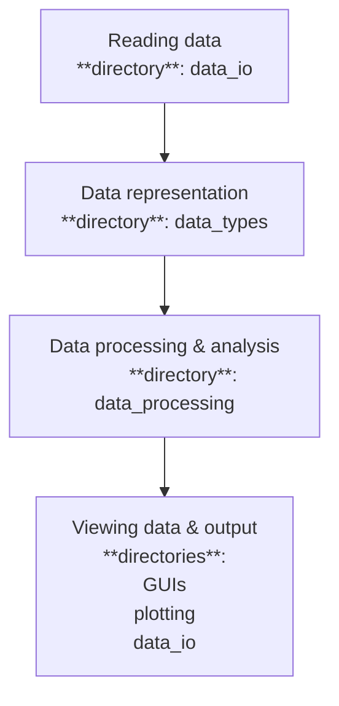

# Pytweezer Tools
Modules and packages for analyzing data from magnetic tweezers, TIRF microscope, or any combination. 
It contains the following core-packages 
<span style = "color:hotpink">**see CHANGELOG.md for release updates per version**</span>


* `data_io`: Everything you need to read/write data
* `data_types`: Contains the internal representation of the data. It provides easy ways of representing a set of traces from the tweezers/TIRF. 
* `data_processing`: **NOT IMPLEMENTED YET** 
*  `GUIs`: **NOT IMPLEMENTED YET**
*  `plotting`: **NOT IMPLEMENTED YET**

<span style = "color:lightgreen">**NOTE: parts not implemented yet are likely subject to change**</span>

The software is designed to follow the natural flow of performing data analysis 



More details on software design can be found in the notes for developers. 
In a nutshell, these four core components (1. reading/writing data, 2. internal representations of data, 3. manipulating data, and 4. external representation of the data (aka. exporting files, plots, GUIs)) are intended to remain modular. 
The developer/contributor notes detail how this is achieved. 

<span style = "color:lightblue"> Individual packages (directories) have their own `README.md` detailing their contents. </span>


## Installation 
### the code base 
#### using `conda`
Using the `conda` environment. Dependencies are listed in the `environment.yml` file
```bash
conda env create --file environment.yml 
conda activate pytw_tools
``` 


#### using `uv`
Dependencies, and other project details, are listed in the `pyproject.toml` file. Dependency managers like `uv` use the `uv.lock` file to specify specific versions of packages used. Once `uv` is installed, you can setup your .venv (will be created inside your current folder) with all requirements installed using
```bash 
uv venv create
uv pip sync
```


### VS-code setup
For VS-code users, this repository contains a `.vscode` directory. It has some handy settings and includes some recommended extensions. You should be able to install these with one click of the button in the Marketplace. There should be a button to instantly install all the recommended extensions. 


## Quick start guide
<span style = "color:lightgreen"> Details will follow. </span>

The following demonstrates a birds-eye view how to handle data from a magnetic tweezers experiment in `pytweezer-tools`. For the purpose of making this guide consise, it is assumed the data was acquired using `pytweezers`. Rest assure that dealing with data from fluorescence microscopy or older data acquired using LabView is not much more difficult. 

### loading data 
The `data_io` directory contains all functions needed to read/write data. 
To load data obtained using `pytweezers`
```python
from data_io.raw_mt import read_raw_mt

FILEPATH = "path_to_file"

# NOTE: This function also happens to work with data from LabView. 
bead_positions_xyz, time = read_raw_mt(path = FILEPATH)
```
This returns a `bead_position_xyz` array of size `(num_beads, num_frames, 3)` and a `time` array of size `num_frames`. 

### time traces
<span style = "color:lightgreen">**NOTE: some of the code blocks contain pseudocode to make the explanation simpler. For instance, the example below is not the actual implementation of `MagneticTweezersTrace`. Many things are actually inherited from the `TimeTrace` class and are also available for traces containing fluorescence data 
**</span>

For convenience, `pytweezer-tools` contains objects of the type `TimeTrace`: simple containers with a time array and any number of named value arrays (of the same length). It also has an identifier, optional labels and labeled sections. 
For example, data from magnetic tweezers measurements can be represented as `MagneticTweezerTrace` instances.

To represent full datasets, we use the `Experiment`: containers for multiple `TimeTrace` instances. For example, data from magnetic tweezers measurements can be represented using `MagneticTweezersTrace` and `MagneticTweezersExperiment`. 

The following code-snippet shows an example of 
* loading raw data 
* doing some cleanup --> set the reference bead 
* subtract the reference signal (drift correction)

```python
from data_io.raw_mt import read_mt_data
from data_types.magnetic_tweezers_experiment import MagneticTweezersExperiment
from pathlib import Path 

# the stuff you will adjust
REF_BEAD_NUMBER = 1 # if you used the last bead, adjust accordingly 
RAW_FILE_PATH = Path("path/to/file") # also works with a regular string, but this just makes it easy to see 


# Using the built-in convenience methods available, we now simply instantiate an Experiment
mt_exp = MagneticTweezersExperiment(
    ID="force calibration", ref_bead_nr=REF_BEAD_NUMBER
)

# Now load the data and let pytweezers-tools handle the creation of MagneticTweezersTrace objects
mt_exp.load_raw_data(path=RAW_FILE_PATH, data_loader_fn=read_mt_data)
mt_exp.create_traces_from_raw_data() 

# Let's subtract the reference bead
mt_exp.set_reference_bead(f"bead_{REF_BEAD_NUMBER}") 
mt_exp.subtract_reference_bead()

# Now let's check how many traces are in this experiment
print(len(mt_exp))
```

To plot all the available traces, simply access `t` and `x`,`y`,or `z` on your traces (now stored as part of the `Experiment`). 
```python 
import matplotlib.pyplot as plt 

#continuing from the previous
for trace in mt_exp.traces:
    #NOTE: Chose here to use the z-position of the bead, but could've done either x- or y- with the exact same syntax 
    plt.plot(trace.t, trace.z)
```

There are several convenience functions available (on both the `TimeTrace` and `Experiment` level) for adding/removing labels (to the whole trace or to sections thereof)
```python
# Adding a labels to a particular traces 
trace_1 = mt_exp.fetch_trace(trace_id="Bead_6")
trace_1.add_labels(labels=["activity", "use for nice figure"])

trace_2 = mt_exp.fetch_trace(trace_id="Bead_123")
trace_2.add_labels(labels=["activity"])


# Say, you already did this prior. To get all the traces with a particular label 

# returns a list equal to [trace_1, trace_2] (it fetches both "Bead_6" and "Bead_123")
traces_w_activity = mt_exp.fetch_traces_by_label(label = "activity")

# returns a list with only [trace_1] (it fetches only "Bead_6")
nice_traces = mt_exp.fetch_traces_by_label(label = "use for nice figure")


# to indicate what part of the trace contained the activity seen in trace 123
trace_2.add_labelled_section( start_index: int, end_index: int, label: str) 

# you can now access the section labels and print it to screen 
print(trace_2.section_labels) 

# Alternatively, create a new MagneticTweezerTrace representing just the desired part of the trace 
activity_only = trace_2.create_time_trace_for_section(
    start_index: int,
    end_index: int,
    new_id: Optional[str] = None,
    )
# now, plot just this part of the trace 
plt.plot(activity_only.t, activity_only.z)
```


 


# DUMMY STUFF FOR NOW 


<span style = "color:lightblue">**NOTE  2:**</span> this follows the natural workflow for analysing data from `pytweezers`. These core elements are intended to keep decoupled from each other. That is:
* If you want to add a new kind of data type (say a three color fluorescence trace). You should only have to define this new type. Functions acting on time traces are not allowed to depend on the specifics of a fluorescence trace (say, the number of colors it has). In stead, we supply the `TimeTrace` or `Experiment` as inpout to the `DataProcessor`.  
* If you want to add a new kind of output file, you should only have to add a reading and writing function in `data_io`. The data structures `TimeTrace`, `Experiment`, etc. are not allowed to know the specific implementation used to write the data. In stead, we supply the trace as an argument to the writing function (_or vice versa if appropriate_). 

This principle is called **_'dependency injection'_** and essentially prevents us from writing code that has extensive checks for "if the data is from the magnetic tweezers, do A. if the code is from the TIRF, do B." Adding a new type of data is then as easy as defining this new class. No need to expand all these `if else` cases in the data processing functions, the reading/writing, etc. 


###  notes on project design and structure (<span style="color:red"> move some of this into the notes of writing clean code</span>)
The following were kept in mind as key requirements in choosing the structure for this package.

1. **Increased flexibility**: 

    Dealing with data from different kinds of setups (magnetic tweezers and/or different kinds of fluorescence datasets). Allowing for custom analysis pipelines.

2. **Varying coding experience levels amongst users**:

    Make the code as readible as possible: **type hints**, **clear naming**, **docstrings and documentation** (where nessecary).
    Further explanation is provided below. 
    Automated code formating using the `ruff` tool (VScode extension added as recommended)

    Lower barrier for adding new code: Minimize coupling between different parts of the code (if not possible to completely eleminate)
    subdirectories are intentionally made to be python libraries (i.e. containing an `__init__.py` file)
    This is done as an additional insentive to make code as portable as possible. For example, a set of functions used to filter signals should be able to be used as a stand alone library in some unrelated project. 
    Also, users wanting to make code just pertaining to their experiments can add their own folder/library in this way. 
    This way the 'less optimally written code' will hopefully be contained within this folder. 


3. **Make the code as modular as possible** 

    Separate **reading data**,**data representation within the code**, **analysis performed on the data**, **output of the data to a file and/or GUI**. 
    If a class that stores bead position information also has a method to write the data to the file, the following happens:
    - If you decide to alter the way data is represented, you need to alter the function for writing the data 
    - If you decide to change the output file format, you need to change both the function used to write the data, as well as the class storing the data (as you hardcoded that the function depends on a particular implementation of the function)

    In stead, the concept of 'dependency injection' is used. 
    A `DataProcessor` object gets a `TimeTrace` object as its input and does not use any information regarding implementation details of the `TimeTrace` object. 
    Now, with hardly any more work the code can now work with any kind of time trace. Also, adding more types of time traces can be done without altering any of the functions used to process the data. 


