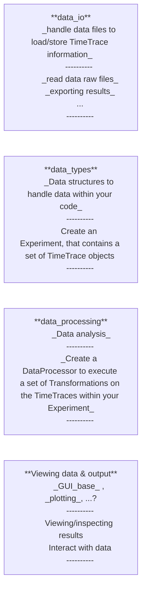

# Pytweezer Tools

<span style="color:hotpink"> Suggestions for a good name are welcome (no need to contain 'py') </span>

A library for handling and (post-)processing data from high-throughput single-molecule experiments (e.g. magnetic tweezers, TIRF/fluorescence microscopy data).
<span style = "color:hotpink">**see CHANGELOG.md for release updates at every version tag.**</span>

This `README` contains:
* Quick start guide 
* Software design notes 
    * overall architecture 
    * `data_io` package 
    * `data_types` package 
    * `data_processing` package 
    * `GUI_base`, `plotting`, and other data viewing packages 
* Contribute 

------
# Installation
Dependencies are manged using `uv` ([uv website for installation instructions](https://docs.astral.sh/uv/)): This is much faster, and more easy to use than `pip` or `conda`. It is also based on using the more modern setup with a `pyproject.toml` file. Dependencies, and other project details, are listed in the `pyproject.toml` file. Dependency managers like `uv` use the `uv.lock` file to specify specific versions of packages used.

> <span style="color:lightgreen">**NOTE: To use the code, you do not need to clone this repository. If not developing the code, it is recommended to simply list this GitLab repository as a dependency. That way you can import everything within this package in your own code and use it like any other library.  </span>

## install as dependency in your own code (no clone of repo required)
To include this library as one of the dependencies for your own project, simply add the following into your `pyproject.toml`. 
```TOML

[tools.dependency]
adlfkj
```
Then run 
```
uv sync
```
This package will automatically be installed into your `.venv`. 


## install after cloning repo (developer)
Once `uv` is installed, you can setup your `.venv`(will be created inside your current folder) with all requirements installed using

### using `uv`

```bash 
uv venv create 
uv pip sync -d 
```
**NOTE: use the `-d` tag to also install `pytest`: needed for development**


### using `conda`
<span style="color:yellow">**NOTE: conda environment not as frequently maintained. For accurate dependencies use `uv`.** </span>

Using the `conda` environment. Dependencies are listed in the `environment.yml` file
```bash
conda env create --file environment.yml 
conda activate pytw_tools
``` 

## VS-code setup
For VS-code users, this repository contains a `.vscode` directory. It has some handy settings and includes some recommended extensions. You should be able to install these with one click of the button in the Marketplace. There should be a button to instantly install all the recommended extensions. 
(extensions include: `ruff` for code formatting, a spell checker that understands snake_case and CamelCase, viewing YAML/TOML files, making `mermaid` diagrams in markdown, and more.)

## Quick start guide
<span style = "color:lightgreen"> Details will follow. Add quick example of loading a dataset and running it through a data processing workflow. </span>

# Software Design notes 
The software is intended to provide data structures and functions that make developing specific data analysis workflows easier. It does not contain a fully-fledged GUI or application. Instead, using this library, we should be able to create applications for **_any data analysis workflow_**. 
See this as "a numpy for high-throughput single-molecule experiments" that you will import into any code base specific to a project/assay (of course less advanced code compared to numpy). 

## overall software architecture 
Key considerations in this software's design
- deal with different types of data sets: magnetic tweezers, TIRF, etc. 
- deal with different analysis workflows: force-extension, rotation-extension, primer-extension, FRET analysis, etc. All require a different order of operations. 
- easy data handling: dealing with repeat experiments, excluding/including time traces, etc. 
- extensible and (relatively) easy to maintain code. 


As such, this library centers around two key concepts: 
* A `TimeTrace`: The core data representation used for any individual signal 
* A `Transformation`: A process that modifies a `TimeTrace` 


The packages within this library follow the natural flow of data. 
In a nutshell, these four core components (1. reading/writing data, 2. internal representations of data, 3. manipulating data, and 4. external representation of the data (aka. exporting files, plots, GUIs)) are intended to remain modular. 


<span style = "color:lightblue"> Individual packages (directories) have their own `README.md` detailing their contents. </span>

## The `data_io` package 
Contains all functions needed to read raw data files. Supports data collected using `pytweezers`, as well as older data collected using `LabView`.

Also contains functions to produce output files
* write information stored in your (final) `Experiment` instance (see `data_types`)
* write information required to get from the (raw) data to all required metrics (see `data_processing`)

The remaining packages are designed such that if one ever changes the way data is stored/written to file, **the only code to be adjusted is within this package**.


## The `data_types` package 
Having loaded the raw data file, we need a convenient way to represent datasets within your code. 

We use abstraction to define a `TimeTrace`: Anything that has a time-array and any number value arrays of equal length. This allows us to define general operations valid for all of our datasets. Using abstraction (`ABC`, abstract base classes, and/or `Protocol`) allows us to separate behavior/properties we expect any dataset to need/have from those specific to magnetic tweezers/fluorescence/FRET, etc.  


```python
@dataclass
class TimeTrace(ABC):
    """
    Defines a generic time trace.
    Generally speaking, a time trace is anything that has a time array and any number of equally sized value arrays.
    traces can have labels assigned to them, or to a part of the trace.

    ----------
    Abstract base class, so still needs specific implementations
    !: Inherit only as dataclass when setting @dataclass(eq=False) in the decorator to ensure proper '==' is implemented as done in this class
    """

    ID: str
    t: NDArray[np.floating]
    labels: list[str] = field(default_factory=list)
    section_labels: dict[tuple[int, int], list[str]] = field(default_factory=dict)

    @property
    @abstractmethod
    def _values(self) -> tuple[NDArray[np.floating], ...]:
        """
        return all the value arrays as a tuple.
        See subclasses for specific implementation
        """

    @property
    @abstractmethod
    def _value_names(self) -> tuple[str, ...]:
        """
        return a tuple of the names of the values. Should be same as the variable names
        used to instantiate class instance.
        """
```
Here using the builtin package `dataclasses` to make use of the convenient syntax (`__init__()` is created automatically, alongside many other properties). 
Most importantly, we see that __any__ `TimeTrace` has the following properties: 
* A string identifier 
* A time array (numpy array with values)
* A list of labels used to qualitatively characterize the (entire) trace
* A dictionary linking portions of the trace (starting frame, ending frame) to their own list of labels. These labels can characterize any particular part of a trace. 

The latter two are optional (you do not need to assign labels / section labels).
Being an abstract base class, we cannot directly create a `TimeTrace`. Rather, we create subclasses that implement the protocol specified (aka. have the two `abstractmethods` with an actual function body implemented).
For example, data from magnetic tweezers experiments can be represented using `MagneticTweezerTrace` instances: 

```python
@dataclass(eq=False)
class MagneticTweezersTrace(TimeTrace):
    # A slight bit disappointing I cannot just define a new variable here without default value
    # At least this seems like a small compromise to make, user-experience wise.
    # i.e. Always call it as MagneticTweezersTrace(ID,t , x=..., y=..., z=...)
    x: NDArray[np.floating] = field(default_factory=lambda: np.array([]))
    y: NDArray[np.floating] = field(default_factory=lambda: np.array([]))
    z: NDArray[np.floating] = field(default_factory=lambda: np.array([]))
    is_REF: bool = False

    @property
    def _values(
        self,
    ) -> tuple[NDArray[np.floating], NDArray[np.floating], NDArray[np.floating]]:
        """
        return all the value arrays as a tuple.
        See subclasses for specific implementation
        """
        return (self.x, self.y, self.z)

    @property
    def _value_names(self) -> tuple[str, ...]:
        """
        return a tuple of the names of the values. Should be same as the variable names
        used to instantiate class instance.
        """
        return ("x", "y", "z")
```

In other words, a `MagneticTweezersTrace` is a `TimeTrace` with values called `x`, `y`, and `z`. 
The `TimeTrace` class has some convenience functions implemented that can be used to add/remove/fetch labelled sections, add/remove labels, etc. (see `src/data_types/README.md` for more details.)

Note, we overloaded the addition, subtraction, multiplication and addition operators to make a `TimeTrace` to make manipulations more intuitive. 

```python
from src.data_types.magnetic_tweezers_trace import MagneticTweezersTrace
from numpy import np

# create a MagneticTweezersTrace with some values for x,y,z,t
t = np.array([...])
x = np.array([...])
y = np.array([...])
z = np.array([...])
mt_trace = MagneticTweezers(ID = 'trace_1', t=t, x=x, y=y, z=z)

# To add a constant value to all the value arrays (x,y,z)
mt_trace *= 4 # or trace2 = mt_trace*4  
mt_trace /= 4

# To multiply all value arrays (x,y,z) by a constant 
mt_trace += 4
mt_trace -= 4 

# If you add two time traces together, you will create a new `TimeTrace` instance with its values equal to the sum of the individual arrays 

trace1 = 4 * mt_trace 
trace2 = trace1 + mt_trace # trace2.x is now equal 5*mt_trace.x , same for y and z 

# Equivalent operations can be performed for subtraction
trace2 = trace1 - mt_trace # trace2.x is now equal 3*mt_trace.x , same for y and z 
```

Despite its importance to the code, a `TimeTrace` is not the most natural entry point for a user. Namely, a single data file contains information for many traces. Hence, we define (an abstract) `Experiment`. We know that an `Experiment` contains a set of `TimeTrace`.

```python
from dataclasses import dataclass, field 

@dataclass
class Experiment(ABC, Generic[TimeTraceType]):
    """
    Defines a generic experiment as a container of TimeTrace instances.
    Generally speaking an experiment has a name, and a set of time traces that are loaded
    from a raw data file.
    Additionally, experimental conditions can be added as a dictionary to keep track of additional metadata.

    """

    ID: str
    traces: list[TimeTraceType] = field(default_factory=list)
    path_to_raw_data: FilePath = Path("")
    experimental_conditions: dict[str, Any] = field(default_factory=dict)

    @abstractmethod
    def _create_trace_list_from_raw_data(self) -> list[TimeTraceType]:
        """
        Implement how the traces should be instantiated based on the loaded raw data
        As data from different experiments might have different structures, intentionally left this as abstract method
        """
        pass
```
An `Experiment` is defined by having
* a string identifier 
* a list of `TimeTrace` instances 
* an optional path to the raw data file 
* a method to instantiate the appropriate `TimeTrace` instances from the loaded dataset (the output from a function in  `data_io` does not return `TimeTrace` objects directly, the `Experiment` is responsible for making this translation)
* an optional dictionary with metadata of the experiment (protein concentration, force, etc.)


Much like the `TimeTrace` class, we cannot directly instantiate an `Experiment`. In stead the user's entrypoint to the code will most likely be a `MagneticTweezersExperiment`

```python
@dataclass
class MagneticTweezersExperiment(Experiment[MagneticTweezersTrace]):
    ref_bead_nr: int = 1
    ref_bead_id: str = "bead_1"

    @property
    def REF_beads(self) -> list[MagneticTweezersTrace]:
        return [trace for trace in self.traces if trace.is_REF]

    def _create_trace_list_from_raw_data(self) -> list[MagneticTweezersTrace]:
        """
        create the instances of the MagneticTweezersTrace based on the loaded raw data

        Make some standard identifiers
        """
        # for actual implementation see `src/data_types/magnetic_tweezers_experiment.py` 
```
Note how subclasses of `Experiment` and `TimeTrace` can have additional properties for convenience. In the case of `MagneticTweezersExperiment` it indicates which of its `MagneticTweezerTrace` instances should be treated as a reference bead. Furthermore, the `Experiment` has several convenience methods implemented for fetching a particular trace, fetching traces with particular (section) labels, etc. Similarly, the `MagneticTweezersExperiment` has convenience functions to change/set the reference bead and perform the corresponding drift correction. 

Once again, we overloaded addition and subtraction operators to easily add/remove particular traces from the experiment. 

```python
from src.data_types.magnetic_tweezers_experiment import MagneticTweezersExperiment
from src.data_types.magnetic_tweezers_trace import MagneticTweezersTrace

experiment = MagneticTweezersExperiment(...)
time_trace = MagneticTweezersTrace(...)

# add another trace to this experiment 
experiment += time_trace 

# exclude traces from the experiment (removes the trace based on the ID)
excluded_a_trace = experiment - time_trace 
```

In conclusion, the `data_types` package contains the core data structures used to manipulate data within your code. Using `Experiment`'s and `TimeTrace`'s allows us to write code in a more intuitive fashion.


## The `data_processing` package 
While the `data_types` package introduces important data structures, it only offers basic functionality (addition, subtraction, averaging, retrieving particular traces, etc.). 
In general, we want to perform additional manipulations to extract information from our raw data. 

To be as versatile as possible, we need a way in which we can implement any kind of operation, and in any order to any type of `TimeTrace` (or `Experiment`). 
Examples include: 
* filtering data 
* selecting parts of a trace (and treating these as time traces in themselves)
* shifting all traces to the origin
* extracting durations of sections / dwell times 
* extracting first-passage times / transition times 

As any particular experimental assay requires its own analysis strategy: how do we create a way of dealing with manipulations in a general sense? 
The answer lies once again in using abstraction. 

Note that regardless of the experiment, all one needs to reproduce any output are:
* the raw data file(s) (optionally including files containing hardware instructions)
* a set of instructions to redo all manipulations to get from the time traces to the output. 


Computer scientists have already figured out a generic way of creating a type of editing software.

For this package, we followed the "command software design pattern": 
* define a generic command (action)
* define a processor that is responsible for executing a set of commands. 

In our case, we define a `Transformation` as any function that takes in a set of target `TimeTrace`s  and produces modified `TimeTrace`s: 

```python 
@dataclass
class Transformation(ABC):
    """
    A generic operation you perform on a TimeTrace that produces another TimeTrace
    NOTE: Dependency injection --> only dependencies on generic TimeTraces and Experiments, not on specific implementations
    """

    # trace identifiers you want to modify
    target_traces: list[str]

    @abstractmethod
    def apply(self, trace_list: list[TimeTrace]) -> list[TimeTrace]:
        """
        apply transformation on the target traces to produce new set of traces
        """
        ...

``` 

Example `Transformation` implementations are `KaiserBesselFilter`, `ShiftToOrigin`, or `SelectFrames`.

To analyze your data we invoke the `ExperimentProcessor` and supply the `Experiment` and the list of `Transformation` operations. The `ExperimentProcessor` in essentially keeps track of the following: 
* What `Transformation` should be performed to what `TimeTrace` within the `Experiment`? 
* A pointer to the "current state" of the data. This allows one to easily undo/redo a `Transformation` by simply telling the `ExperimentProcessor` to move this pointer around. Only when you call `transform_traces()` will you actually perform the set of `Transformations`. In other words, you always start your calculation from the start of the list. This is what makes 'undoing' an operation easy: You just never actually perform it (just recalculate the state of the data until just before the step you want to reverse). 


```python
@dataclass
class ExperimentProcessor:
    """
    ExperimentProcessor class keeps track of the set of Transformations to perform, applying the transforms is delayed until an explicit call to `transform_traces()`
    this way you can change your workflow by undoing/redoing transforms as many times as you want (as it under the hood just reproduces the series of events starting from the initial state)
    """

    original_experiment: Experiment
    transformations: list[Transformation] = field(default_factory=list)
    state_index: int = 0

    def add_transformation(self, transformation: Transformation) -> None:
        """
        register the transformation.
        NOTE: If you undid a transformation (without redoing it), you will at this point 'confirm you actually never wanted to perform that operation'. After registering, we
        assume you want to point to the latest transformation.
        """


    def undo(self) -> None:
        """
        simply move pointer back by one (unless you are already pointing to the first Transformation)
        """


    def redo(self) -> None:
        """
        simply move pointer forward by one (unless there you are already pointing to the last Transformation)
        """


    def transform_traces(self) -> Experiment:
        """
        Only when you call this function will things actually be computed.
        You compute it up until the state index
        """
```
<span style="color:hotpink">see the Quick start guide for an example of setting up your data analysis workflow. <span>


## The `data_view` package (???)
<span style = "color:lightgreen"> Not yet implemented, details will follow </span>
Finally, we need ways to view data and to interact with it. 
* GUI
* plotting
*  etc. 


 


