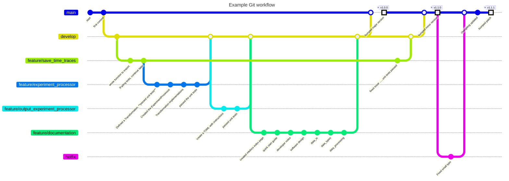

???+ Info 
    The information on this page is only relevant for those who want to modify/add the code directly. If this is you, please read the following carefully.

# Guidelines for developers. 

Maintaining a clean code base is not much different from maintaining a clean laboratory space. There are a bunch of tools that can make it easier to keep things organized in the lab (the eLabJournal, a cleaning schedule, an inventory list, booking system for setups, etc.), but we still have to actively adhere to these guidelines/rules for everything to work properly. Essentially the same can be said about maintaining a neat software package. 
Perhaps one of the simplest, yet very important, rules is to maintain some form of consistency. Every software package might have slight differences in their style of writing/versioning. Adhering to whatever choice has been made at the start just makes the entire code allot easier to read. 
Here are some guidelines/rules/already made choices on all aspects important for developers: all the way from how to name your variables to how to name/use your git branches.


## Tools 
| Tool | Description|
|------|------------|
|`uv`  | `Python` dependency management|
|`git` | Code versioning / track changes| 
|`ruff`| Code formatting (for `VScode` users: extension is available and configured)|
|`pytest`| Code tests/ unit tests (Coverage reports generated using `pytest-cov`)| 


## Directory structure 
To keep things consistent, adhere to the current structure. 

* The root only contains some configuration files (`pyproject.toml`, `mkdocs.yml`, `.gitignore`, etc.), and a  `README.md`. 
* Code is stored under `src/`
* Corresponding unit tests are stored under `tests/`. 
* The structure of the `tests/` directory follows that of the `src/` directory. That is, unit tests for `src/data_types/time_trace.py` are written in `tests/data_types/test_time_trace.py`. 

## Python code
Want the code to remain as readable as possible and as easy to maintain as possible? Adhering to the following points is a good start.  


- Use `snake_case` for all variables and functions. 
  ```python 
  def forty_two() -> float:
    return 42.  
  
  
  my_variable = forty_two() 
  ```

- Use `CamelCase` for class names and custom types.
  ```python 

  COOL_ACTIVITIES = ["chill", "relax", "make music"]

  class SomeCoolClass:
    def __init__(self, attribute_1):
        self.attribute_1 = attribute_1 
        self.attribute_2 = attribute_2 
    
    @property 
    def awesomeness_level(self) -> float: 
        ``` calculate how awesome you are ```
        return self.awesomeness_level 

     def is_cool(activity: str) -> bool:
        if activity in cool_activities: 
            return True 
        else:
            return False 

  ...
  ``` 
- Use capital letters for constants, and define those on top of a file (below the imports) if needed.
```python 
PI = 3.1415
```
- Use a spell checker: Prevents from everybody needing to type the word "`reference_bread`" in all their functions. 
- Use an (auto-)formatting tool. Here we use `Ruff`. Consistent formatting throughout all files is one of those things that makes for the code to be much easier to read. This automatically takes care of 
  - structuring your imports on the top of your files 
  - removing unnecessary blanc lines and white spaces
  - folding of long lines of codes
- Use type hints for all function/method arguments. Also indicate the return type: 
  - For arguments: try to be as generic as possible. For example, if your method works with any container of items you can loop through, favor using the `Iterable` type over the `list` type. 
  - For return types: Be as specific as possible. You should know exactly what the result is of your operations. Hence, you do not return any kind of `Iterable`, but you will return a `list`, `set`, etc. 
  - Functions that do not return anything (say, writing something to file), use `None` as the return type. 
- Spell out variable names. We live in the day and age of autocompletion, no need to abbreviate everything. Prefer using `number_traces` over `N_tr`. The one exception to this rule is the time array of a `TimeTrace` which is simply called `t`. 
- Use descriptive function names. 
  - Include a verb in the name. For example, `calculate_area()` or `retreive_date_from_file()`. Again, brevity should not be your primary concern. 
  - Performing some check / returning a boolian? Use `validate_...()` or `is_...()`. The latter pairs particularly well with Python's syntax for conditional statements:
    ```python
    if is_prime(number):
    print(f"{number} is a prime number")
    ```

* Avoid wildcard imports: `from module import *`. 
* Explicitly import the functions/classes from a particular module you use later on. 
    ```python 
    from module import function, ClassName
    
    # later in the code, no need to say module.function 
    value = function() 

    my_object = ClassName()
    my_object.perform_operation()
    my_object.attribute
    ```
* Some exceptions to this rule are packages that are commonly imported as a whole (and have a commonly used alias). Some examples 
  ```python 
  import numpy as np 
  import pandas as pd 
  import matplotlib.pyplot as plt 

  import os 
  import sys 
  import pickle
  import toml 
  ```

* Try avoiding long lists of `if/else` statements. 99% of the time these are a sign of suboptimal design choices. If you find yourself using such a list of `if/else` statements (longer than simple ones), try discussing with others. Most likely there is some combination of defining functions or introducing abstraction possible. This is one of the best ways to make the code much more readable. 
* The same applies to any set of nested `for` loops with indented `if/else` clauses leading to a `while` loop, ... ;-). There most likely is a better way. 


Some additional choices made: 

- the type of a `Numpy` array: Use `NDArray[np.floating]`. More conventional is to use `np.ndarray`, but that does not allow you to prescribe the type of the elements. 
- `Numpy` is a bit particular and works with `np.floating` and `np.integer` in stead of the primary types `float` and `int`. Hence, when applicable, just make use of the type aliases defined as follows: 
    ```python 
    import numpy as np 
    Floating = float | np.floating 
    Scalar = float | np.floating | int | np.integer 
    ``` 

* Use `pathlib.Path` for path names. This is the modernized version of using the `os` library. The types become more descriptive than `str`. For user-fiendlyness, all functions in `data_io` are made to work with either a `Path` or a `str`. 
  ```python
  from pathlib import Path 
  FilePath = Path | str 
  ```


## Unit tests with `pytest` 
Add explanation here

```zsh
pytest -cov
```

```zsh
coverage html
```


## Git Repository 
Some guidelines for working with the repository. 

* The `main` branch only contains code that is **tested and fully integrated**. Do not amend this code unless it is to fix a typo or something small. 
* Make often `commits`. Try to group files together that pertain to the same change. Try to break up large amendments into several `commits`. This makes the commit history easier to track and forces you to break up the problem into smaller bits. 
* Every feature (or bug fix) gets its own branch where you can implement (or fix) it without problem. **Stick to one (main) feature per branch**. Grouping many changes into one `new_feature_branch` makes it harder to track what is added. Also makes it very hard to revert to a point before a specific feature was implemented / localize bugs. Having more branches with just a couple commits is less clutter than having one branch with hundreds of commits. 
* Name your branch as follows (following standard naming conventions here)
    - `feature/<feature>`
    - `issue/<issue>`
    - `hot_fix/<small issue>`
* Feature and issue branches branch of from the `develop` branch. When done, i.e. you new feature is implemented and you pass your unit tests, you integrate it with the other code by merging into the `develop` branch. 
* The `develop` branch thus serves as a safe way to test how code integrates together. 
* When all is fine, merge into `main` to update the "user facing code". 
* When merging with `main`, create a new `version` by telling `git` to add a `version tag`.
  * standard version naming convention `vX.Y.Z`:
    * `X`: major version. Big changes. Say a bunch of new additions have been made to allow for a whole new type of experimental data. Also bump the major version when the change might affect backwards compatibility. 
    * `Y`: minor version. Adding a new feature that stacks onto the existing without affecting backwards compatibility. Major vs minor version is a bit of a gray area. Decide on some internal standards. 
    * `Z`: bug fixes and other small updates. Use this when you did not add any new functionality, but just updated a small part to fix a bug. 
* Add your changes in the `docs/CHANGELOG.md`.
* Tell `uv` to also bump the version accordingly. Just to make the `pyproject.toml` be up-to-date (not an issue if you forget to do this as we are not publishing this package to PyPi or similar.). 

