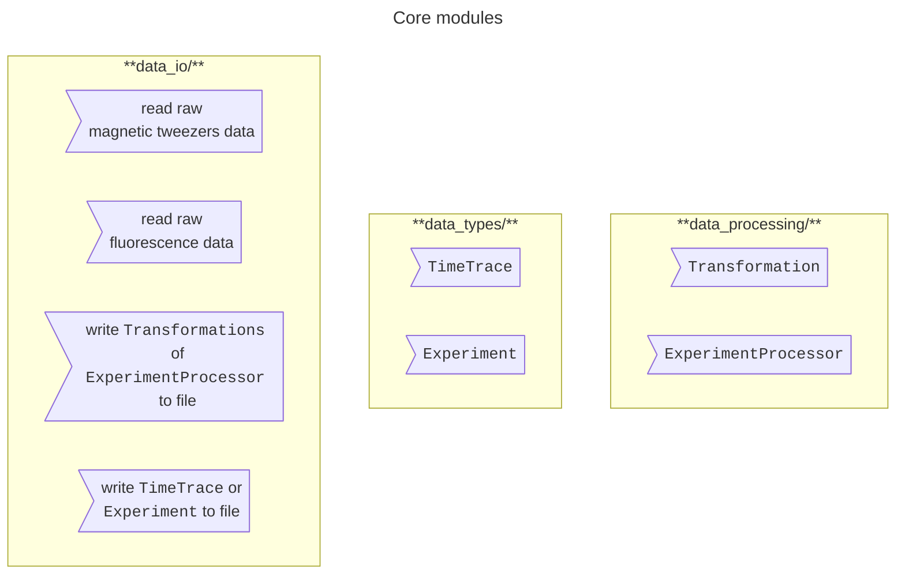
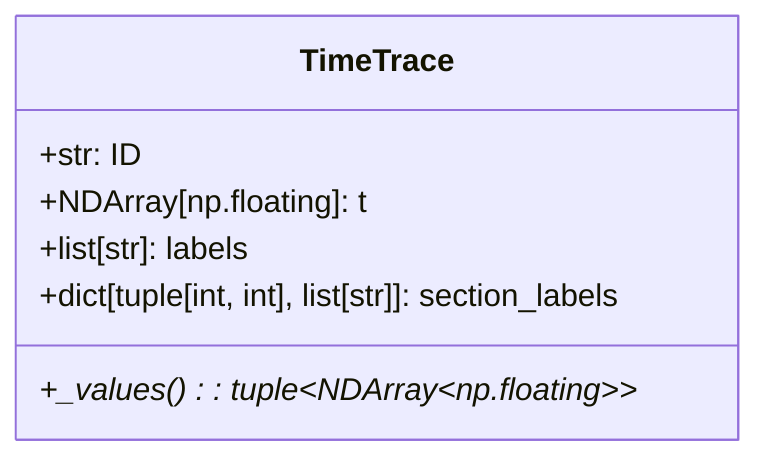
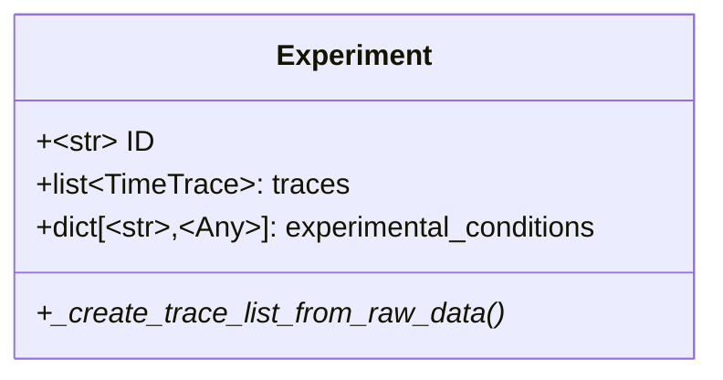
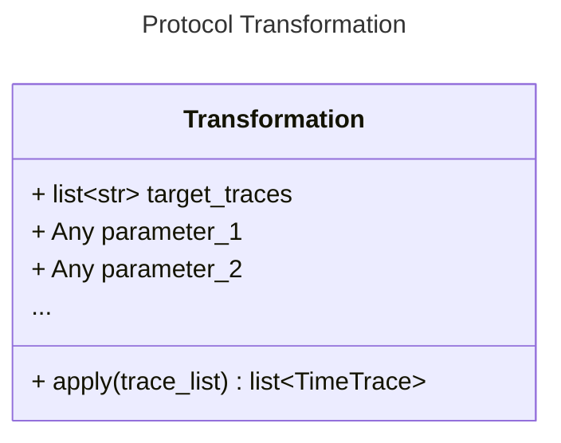
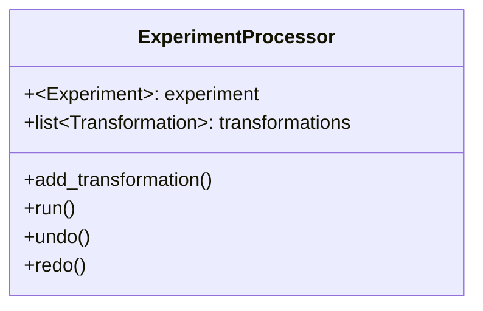
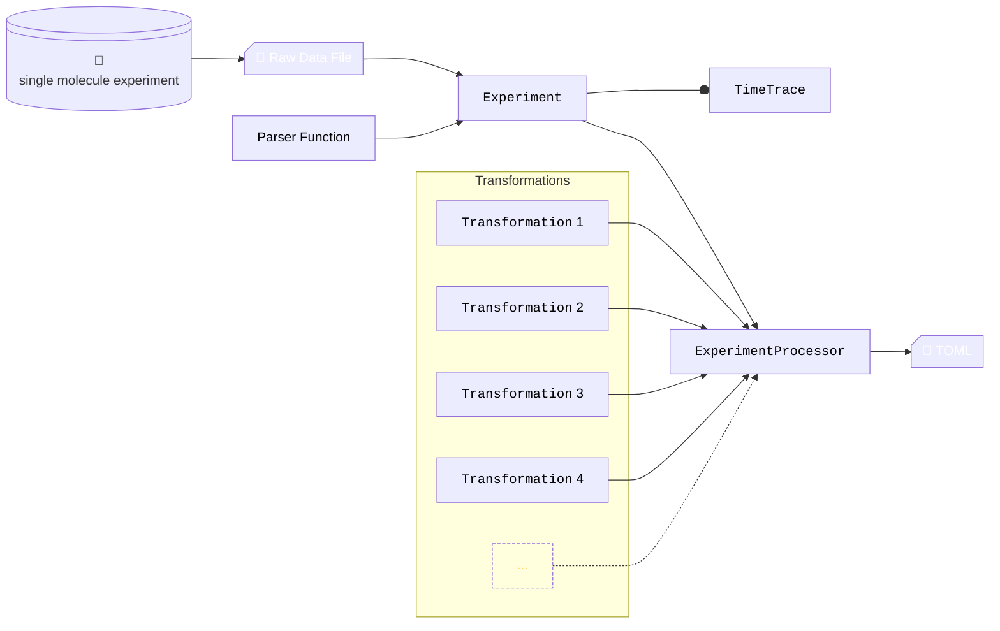

# Software Design notes 
Here, we detail some software architectural choices / the goal of this software package in broad strokes. 

## Desired (user) experience stories
The following formulates the set of ***requirements*** this software library must have to achieve the following **goals**.
This software should provide the user with ...

- A **toolkit** with functions, classes, and objects that can be imported into any other dedicated data analysis pipeline. Creation of ***a GUI is is not a concern of this project*** as that should be a series of interactive components that call the elements available in this library.  
- A convenient syntax to apply most data processing pipelines to most data sets with the same relative ease . 
A user can easily load and manipulate data from all of our experimental setups (MT, MT-TIRF, old interface / new interface, etc.) in a unified manner. 

- modules for parsing data acquired with different setups, controlling software / frameworks. The data should be parsed into a unified format for postprocessing. 
- Create a generalized internal representation of experimental data for us to manipulate time traces from either magnetic tweezers or fluorescence experiments similarly. 
- Simplify the default output file, making it easier to interpret and reuse data in the lab. 

>The user should have the flexibility to apply any desired postprocessing pipeline to its respective data. Applying any kind of pipeline should happen at the same relative ease.

-  ***Same syntax, regardless of assay***. Treat force spectroscopy, torque spectroscopy, as well as fluorescent, and FRET time traces with the same operations. In an abstract sense, ***these all deal with time traces***. 
- ***Flexibility*** to change the order of operations in postprocessing and analyzing data. For example, while assays may require you to filter the traces as the first step in the process, others may require to perform some other manipulations beforehand. 

>The code in this repository should be as easy to read as possible. Prioritize readability over feature depth / complexity. 

- Reduce coupling: loading data and processing data are different concerns and should be done using dedicated modules (packages). 
- Well-written code can be 'self-documenting' for the most part. Adding type hints to a carefully chosen name for a function and its input / output variables leaves little doubt on what it does and how it should be used. 
- Try to adopt some standard best practices for ***versioning***, ***testing***, and ***maintaining*** a python package. 

- See [Guidelines for developers](developer_notes.md)

## Core concepts 
This library contains the following core elements

The code is organized based on the natural flow of data. 

----------
### `data_io`
Contains modules for reading raw experimental data and for writing the results of analysis performed on the data. These modules are likely the most specific to the type of experimental setup used in the lab (especially the reading of data). It is also likely the part to be subject to the most change over time (especially the format results are stored as). Splitting off these functionalities into their own package therefore enforces one to make the other components of this library to be reusable / adjustable to any type of input/output format. 

----------
### `data_types`
After parsing your raw data file, you need an internal representation of the data that makes it convenient to manipulate. 
This package introduces two core classes: `TimeTrace` and `Experiment`. 

These two core classes are defined as Abstract Base Classes (`ABC`). Meaning although we are unable to define all kinds of `TimeTraces` or `Experiments`, we know for certain that:
* A `TimeTrace` as a time array. 
* A `TimeTrace` has any number of additional value-arrays. For a `MagneticTweezersTrace` this will be the x,y, and z coordinates of the bead. A `FluorescenceTrace` will have intensity values in stead. Value arrays must be of the same length as the time array. 
* A `TimeTrace` can have any number of qualitative labels assigned to it. Similarly, a particular section of the trace may be assigned qualitative labels.
* An `Experiment` primarily contains a list of `TimeTrace` instances (i.e. `MagneticTweezersExperiment` contains a list of `MagneticTweezersTrace` instances), and an optional dictionary with some metadata to describe experimental conditions. 

Concrete implementations (e.g. `MagneticTweezersExperiment` and `MagneticTweezersTrace`) implement:
+ `_values()` :: A method that defines the value arrays of the `TimeTrace`. 
+ `_create_trace_list_from_raw_data()`:: A method that prescribes how to parse loaded raw data into the prescribed form of `TimeTrace` instances. 

Both the parent classes and the concrete implementations contain several convenience methods for basic manipulations. 

------------
### `data_processing`
Finally, this package concerns itself with analysis of the data. 
It introduces the following core concepts: `Transformation` and `ExperimentProcessor`. 

A `Transformation` is any method that applies an operation to a list of target `TimeTrace` objects and returns a modified list of `TimeTrace` objects. 
Examples of concrete implementations are `KeizerBesselFilter`, `MovingAverageFilter`, `SelectTraces`, `SelectTracesByLabels`, etc. 
While defining a class in stead of a function does lead to some additional 'boilerplate' code (i.e. additional lines of code that are always the same), it allows for a uniform definition of a chain of `Transformation` operations. 
The `ExperimentProcessor` keeps track of this list and allows you to `run()` the pipeline, as well as `undo()` and `redo()` single steps easily. 

Transformations are only applied when you call the `.run()` method. The `ExperimentProcessor` keeps track of where in the pipeline (list of transformations) you are at, and applies all transformations from the start upon a call to `.run()`. In turn, `data_io` has methods to write the output of an `ExperimentProcessor` to a TOML file containing only the set of instructions to redo all the desire transformations on your raw data. This reduces the amount of intermediate files stored by default and makes things more uniform across different kinds of experiments. For more info see [data_processing](data_processing.md).

------------
## Show high-level class diagrams / workflow diagrams 
The core concepts introduced above interact with the following basic workflow in mind: 

1. Perform the single-molecule experiment to generate the raw data file 
2. Instantiate an `Experiment` object (`MagneticTweezersExperiment` with working with the magnetic-tweezers) by supplying both the raw data file and a function from [`data_io`](data_io.md) that reads this type of file. The output of the function is standardized. Hence, a concrete [`Experiment`](data_types.md) knows how to parse this into concrete [`TimeTrace`](data_types.md) objects. 
3. Create an [`ExperimentProcessor`](data_processing.md) by supplying your [`Experiment`](data_types.md)
4. Register your desired set of manipulations /[ `Transformation`](data_processing.md) instances and run the analysis. 
5. Store the instructions to redo this analysis into a [`TOML` file](data_io.md).